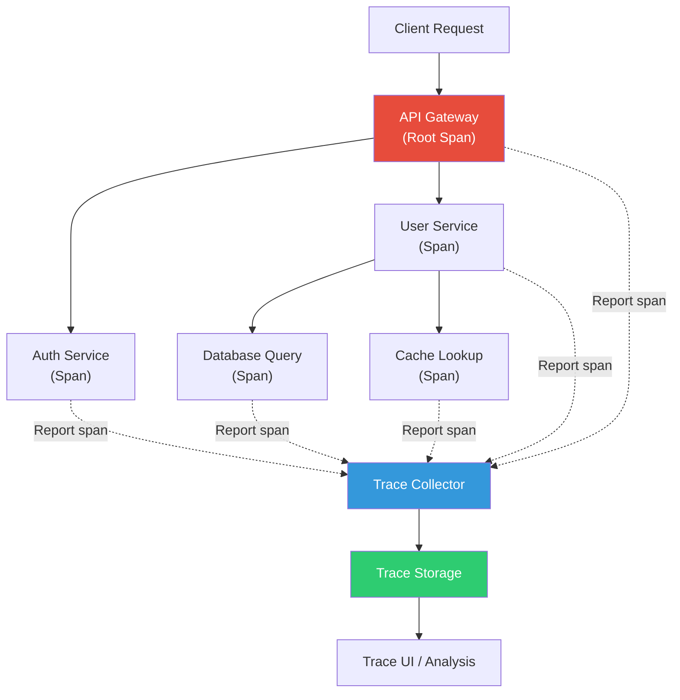
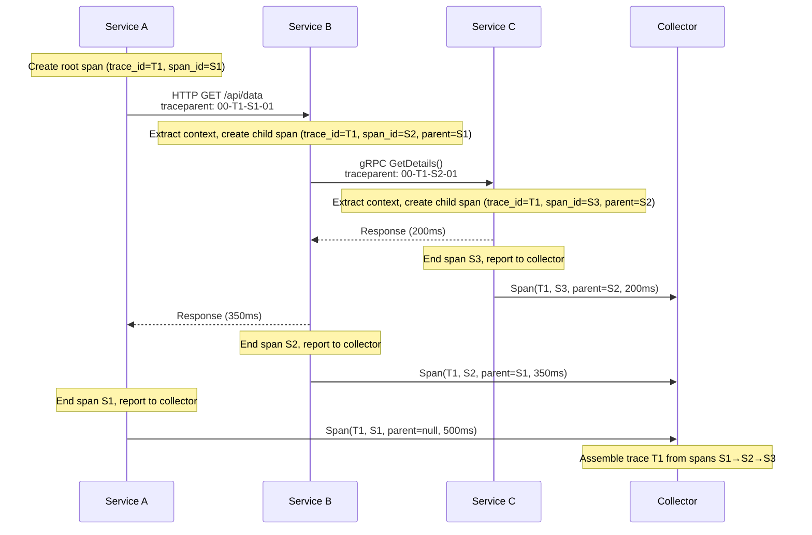
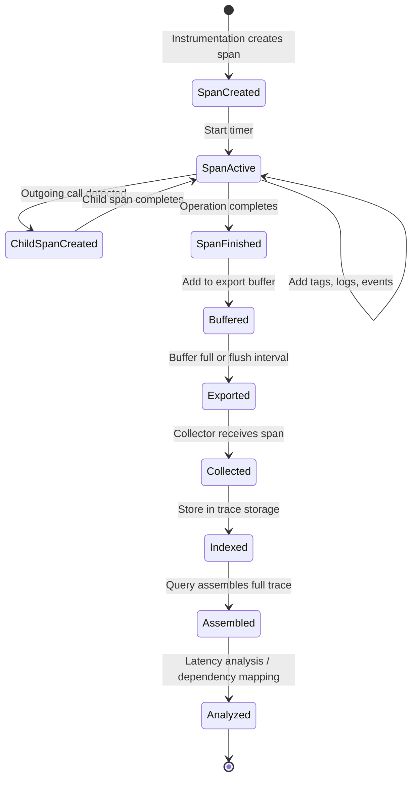

# Distributed Tracing

A distributed tracing system built from first principles: span collection with hierarchical trace assembly, context propagation across service boundaries, latency analysis with critical path detection, and service dependency mapping from trace data. Demonstrates the core architecture behind Jaeger, Zipkin, AWS X-Ray, and OpenTelemetry — and why distributed tracing is essential for understanding, debugging, and optimizing microservice architectures where a single user request can touch dozens of services.

## Theory & Background

### Why Distributed Tracing?

In a monolithic application, debugging is straightforward — you read the stack trace, set a breakpoint, and step through the code. In a microservice architecture, a single user request might flow through 10-50 services, each with its own logs, metrics, and failure modes. When something goes wrong — a request is slow, an error occurs, a timeout fires — the question is: **which service caused it?**

Traditional monitoring tools (logs, metrics) answer questions about individual services but not about request flows. Logs tell you what happened in one service. Metrics tell you aggregate behavior (p99 latency, error rate). But neither tells you that *this specific request* was slow because Service C's database query took 800ms, which caused Service B to timeout, which caused Service A to return a 500 error.

Distributed tracing solves this by recording the **causal chain** of operations across services for each request. A **trace** represents the full journey of a request, composed of **spans** — each span represents a unit of work in one service (an HTTP handler, a database query, a cache lookup). Spans are linked by parent-child relationships, forming a tree that shows exactly how time was spent.

### Core Concepts

A **span** is the fundamental unit of tracing. It records:

- **Trace ID**: A globally unique identifier shared by all spans in the same trace
- **Span ID**: A unique identifier for this span
- **Parent Span ID**: The span that caused this span (null for the root span)
- **Operation name**: What this span represents (e.g., `HTTP GET /api/users`)
- **Start time** and **duration**
- **Tags**: Key-value metadata (e.g., `http.status_code=200`, `db.type=postgresql`)
- **Logs/Events**: Timestamped annotations within the span

A **trace** is a directed acyclic graph (DAG) of spans, typically a tree. The root span represents the entry point (e.g., an API gateway receiving a request), and child spans represent downstream calls.

The trace structure can be formalized as:

```math
\text{Trace} = (V, E) \quad \text{where } V = \{s_1, \ldots, s_n\} \text{ are spans and } E = \{(s_i, s_j) : s_i \text{ is parent of } s_j\}
```

Each span $s_i$ has a start time $t_i^{\text{start}}$ and end time $t_i^{\text{end}}$, with the constraint that a child span's lifetime is contained within its parent's:

```math
t_{\text{parent}}^{\text{start}} \leq t_{\text{child}}^{\text{start}} \leq t_{\text{child}}^{\text{end}} \leq t_{\text{parent}}^{\text{end}}
```



### Context Propagation

For spans across different services to be linked into a single trace, the **trace context** must be propagated across service boundaries. When Service A calls Service B, it injects the trace ID, span ID, and sampling decision into the request (typically as HTTP headers). Service B extracts this context and uses it as the parent for its own spans.

The W3C Trace Context standard defines the propagation format:

```
traceparent: 00-{trace_id}-{parent_span_id}-{trace_flags}
```

For example: `traceparent: 00-4bf92f3577b34da6a3ce929d0e0e4736-00f067aa0ba902b7-01`

Context propagation must work across all communication protocols — HTTP, gRPC, message queues, async tasks. Each protocol has its own injection/extraction mechanism, but the semantic is the same: carry the trace context from caller to callee.



### Sampling

In high-throughput systems, tracing every request is prohibitively expensive — both in terms of network overhead (reporting spans) and storage (retaining traces). **Sampling** reduces the volume while preserving statistical representativeness.

**Head-based sampling** makes the sampling decision at the root span and propagates it to all downstream services. With a sampling rate $r$:

```math
\text{sample}(\text{trace}) = \begin{cases} \text{true} & \text{if } \text{hash}(\text{trace\_id}) < r \cdot 2^{64} \\ \text{false} & \text{otherwise} \end{cases}
```

Using the trace ID hash ensures all services make the same decision for the same trace — you never get a partial trace where some spans are sampled and others aren't.

**Tail-based sampling** defers the decision until the trace is complete, allowing you to keep interesting traces (errors, high latency, specific endpoints) and discard boring ones. This requires buffering all spans until the trace completes, which adds complexity and memory pressure.

### Latency Analysis and Critical Path

Given a complete trace, **latency analysis** identifies where time is spent. The **critical path** is the longest chain of sequential operations — the minimum time the request could take even with infinite parallelism.

For a trace tree with spans $\{s_1, \ldots, s_n\}$, the critical path is the path from root to leaf with the maximum total duration of non-overlapping work:

```math
\text{critical\_path} = \arg\max_{p \in \text{paths}(root \to leaf)} \sum_{s \in p} \text{self\_time}(s)
```

where **self-time** is the time a span spends doing its own work (not waiting for children):

```math
\text{self\_time}(s) = \text{duration}(s) - \sum_{c \in \text{children}(s)} \text{duration}(c)
```

If a span's self-time is high, the bottleneck is in that service's own processing. If a span's duration is high but self-time is low, the bottleneck is in a downstream service.

### Service Dependency Mapping

Trace data reveals the **service dependency graph** — which services call which other services, how often, and with what latency characteristics. This graph is extracted by aggregating parent-child relationships across all traces:

```math
\text{edge}(A, B) = \{(A, B) : \exists \text{ span } s_A \text{ in service } A \text{ with child } s_B \text{ in service } B\}
```

The dependency graph enables:
- **Impact analysis**: If Service C goes down, which upstream services are affected?
- **Capacity planning**: Which services handle the most traffic?
- **Architecture visualization**: What does the actual (not designed) service topology look like?



### Trace Collection Pipeline

```mermaid
gantt
    title Trace Collection and Processing Pipeline
    dateFormat X
    axisFormat %s

    section Instrumentation
        Create root span        :0, 1
        Propagate context       :1, 2
        Create child spans      :2, 5
        Finish spans            :5, 6

    section Export
        Buffer spans locally    :2, 7
        Batch export to collector :7, 8

    section Collector
        Receive span batches    :8, 9
        Validate and enrich     :9, 10
        Tail sampling decision  :10, 11

    section Storage
        Write to trace store    :11, 13
        Build service graph     :13, 14
        Index for queries       :14, 15
```



### Tradeoffs and Alternatives

| Aspect | This Implementation | Alternative | Tradeoff |
|--------|-------------------|-------------|----------|
| **Sampling** | Head-based (deterministic hash) | Tail-based, adaptive, priority-based | Head-based is simple and consistent; tail-based captures interesting traces but requires buffering all spans; adaptive adjusts rate based on traffic |
| **Propagation** | W3C Trace Context headers | B3 (Zipkin), Jaeger native headers | W3C is the standard; B3 is widely supported in older systems; using multiple formats adds complexity but improves interop |
| **Storage** | In-memory with file persistence | Elasticsearch, Cassandra, ClickHouse | In-memory is fast for demos; Elasticsearch enables full-text search on tags; Cassandra scales writes; ClickHouse is efficient for analytical queries |
| **Collection** | Direct reporting (push) | Agent-based (sidecar), collector pipeline | Direct push is simple; agent-based decouples app from collector; pipeline (OpenTelemetry Collector) adds batching, retry, and routing |
| **Trace assembly** | Eager (assemble on query) | Streaming (assemble as spans arrive) | Eager is simpler; streaming enables real-time alerting on trace patterns but requires stateful processing |

### Key References

- Sigelman et al., "Dapper, a Large-Scale Distributed Systems Tracing Infrastructure" (2010) — [Google Research](https://research.google/pubs/pub36356/)
- Kaldor et al., "Canopy: An End-to-End Performance Tracing And Analysis System" (2017) — [ACM SOSP](https://doi.org/10.1145/3132747.3132749)
- W3C Trace Context Specification — [W3C Recommendation](https://www.w3.org/TR/trace-context/)
- OpenTelemetry Specification — [OpenTelemetry](https://opentelemetry.io/docs/specs/)
- Mace et al., "Pivot Tracing: Dynamic Causal Monitoring for Distributed Systems" (2015) — [ACM SOSP](https://doi.org/10.1145/2815400.2815415)

## Real-World Applications

Distributed tracing gives engineering teams visibility into how requests flow through complex systems. Without it, debugging a slow API response in a microservice architecture is like finding a needle in a haystack — with tracing, you can see exactly which service, which database query, or which network call is the bottleneck. It's become a non-negotiable part of operating any system with more than a handful of services.

| Industry | Use Case | Impact |
|----------|----------|--------|
| **Microservices debugging** | Engineering teams using Jaeger or Zipkin to trace requests across 50+ microservices, identifying the exact service causing latency spikes | Reduces mean time to resolution (MTTR) from hours to minutes by showing the full request path and pinpointing bottlenecks |
| **SRE and reliability** | Site reliability teams using trace data to set and monitor SLOs (service level objectives) per endpoint, with automatic alerting on latency regressions | Enables proactive detection of performance degradation before it impacts users, maintaining 99.9%+ availability targets |
| **Performance optimization** | Platform teams analyzing critical paths across traces to identify optimization opportunities — caching candidates, parallelization targets, unnecessary sequential calls | Typical optimization cycles yield 30-50% latency reduction by eliminating redundant calls and adding caching at bottleneck points |
| **Cloud platforms** | Cloud providers (AWS X-Ray, Google Cloud Trace, Azure Monitor) offering managed tracing as a core observability service for customer workloads | Provides out-of-the-box visibility for serverless and containerized applications without requiring customers to build tracing infrastructure |
| **E-commerce** | Online retailers tracing checkout flows from cart to payment to fulfillment, ensuring each step completes within latency budgets during peak traffic | Prevents revenue loss during high-traffic events (Black Friday, flash sales) by identifying and resolving bottlenecks before they cause timeouts |

## Project Structure

```
distributed-tracing/
├── src/
│   ├── __init__.py
│   ├── collector/
│   │   ├── __init__.py
│   │   ├── collector.py           # Span collector: receives, validates, and batches spans
│   │   ├── sampling.py            # Head-based and tail-based sampling strategies
│   │   └── exporter.py            # Span export to storage backends (memory, file, network)
│   ├── trace/
│   │   ├── __init__.py
│   │   ├── span.py                # Span data model: trace ID, span ID, parent, tags, logs
│   │   ├── trace.py               # Trace assembly: reconstruct trace tree from span collection
│   │   └── context.py             # Trace context: trace ID, span ID, sampling flag, baggage
│   ├── propagation/
│   │   ├── __init__.py
│   │   ├── w3c.py                 # W3C Trace Context injection and extraction
│   │   ├── b3.py                  # B3 (Zipkin) propagation format
│   │   └── propagator.py          # Composite propagator supporting multiple formats
│   └── analysis/
│       ├── __init__.py
│       ├── latency.py             # Latency analysis: critical path, self-time, percentiles
│       ├── dependency.py          # Service dependency graph extraction and visualization
│       └── anomaly.py             # Anomaly detection: latency outliers, error pattern detection
├── requirements.txt
├── .gitignore
└── README.md
```

## Quick Start

```bash
pip install -r requirements.txt

# Generate sample traces and visualize a trace tree
python -m src.trace.trace --services 5 --depth 4 --traces 100

# Run the span collector with head-based sampling
python -m src.collector.collector --sampling-rate 0.1 --port 9411

# Analyze latency and find the critical path in a trace
python -m src.analysis.latency --traces 1000 --show-critical-path

# Build and visualize the service dependency graph
python -m src.analysis.dependency --traces 10000 --output dependency_graph.png

# Demonstrate context propagation across simulated services
python -m src.propagation.w3c --services "gateway,auth,user,db" --format w3c
```

## Implementation Details

### What makes this non-trivial

- **Trace assembly from out-of-order spans**: Spans arrive at the collector in arbitrary order — a child span may arrive before its parent. The assembler buffers spans by trace ID and reconstructs the tree once all spans have arrived (or a timeout expires). It handles orphan spans (parent never arrives) by attaching them to a synthetic root.
- **Critical path computation with parallel spans**: When a parent span has multiple concurrent children, the critical path follows the slowest child. The implementation correctly handles overlapping child spans by computing the union of their time intervals and identifying the non-overlapping self-time of the parent.
- **W3C Trace Context with tracestate**: Beyond the basic `traceparent` header, the implementation supports `tracestate` — a vendor-specific key-value list that allows tracing systems to propagate their own metadata alongside the standard context. The parser handles the full grammar including escaping rules.
- **Tail-based sampling with trace completeness detection**: The tail sampler buffers all spans for a configurable window (e.g., 30 seconds) and makes the sampling decision when the trace is complete. Completeness is detected by tracking the root span — once the root span arrives and all referenced parent IDs have corresponding spans, the trace is considered complete.
- **Service dependency graph with edge weights**: The dependency extractor aggregates call relationships across thousands of traces, computing edge weights (call count, mean latency, error rate) and detecting cycles (which indicate circular dependencies). The graph is exported in a format suitable for visualization with networkx or Graphviz.
